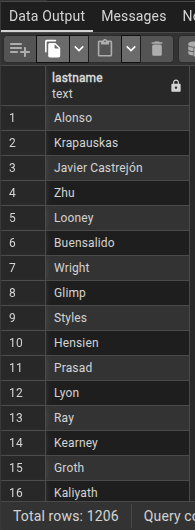
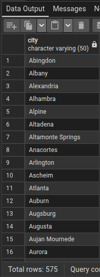

*DISTINCT - não retorna dados duplicados*

1 - QUANTOS SOBRENOMES ÚNICOS TEMOS NA TABELA person_person?

    SELECT DISTINCT lastname

    FROM person_person

2 - QUANTAS CIDADES ÚNICAS QUE TEMOS CADASTRADAS NO SISTEMA?

    SELECT DISTINCT "city"
    
    FROM person_address
    
    ORDER BY "city" ASC;

    

