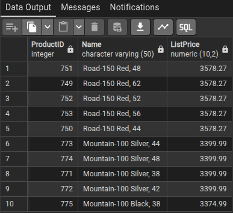
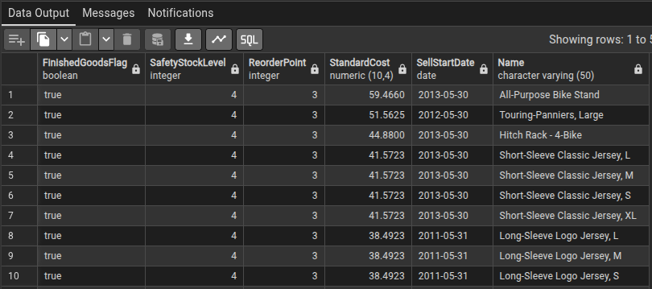

1 - OBTER O ID DOS 10 PRODUTOS MAIS CAROS CADASTRADOS NO SISTEMA, LISTANDO DO MAIS CARO PARA O MAIS BARATO.
    
    SELECT "ProductID", "Name", "ListPrice"
    
    FROM production_product
    
    ORDER BY "ListPrice" DESC
    
    LIMIT 10;

2 Listar todos os produtos, aplicando a seguinte ordem de prioridade:

Regras de ordenação (em ordem de importância)

🔹Produtos finalizados (FinishedGoodsFlag = 1) primeiro   
🔹Depois, produtos não finalizados  

Dentro de cada grupo:

🔹Produtos com menor margem de segurança primeiro

margem de segurança = SafetyStockLevel - ReorderPoint
quanto menor a diferença, maior o risco

🔹 Em seguida, ordenar por:

StandardCost do maior para o menor

🔹 Se empatar:

SellStartDate mais antiga primeiro

🔹 Se ainda empatar:

Name A → Z

    SELECT "FinishedGoodsFlag", "SafetyStockLevel", "ReorderPoint", "StandardCost", "SellStartDate", "Name"
    FROM production_product
    ORDER BY "FinishedGoodsFlag" DESC, 
    ("SafetyStockLevel" - "ReorderPoint") ASC,
    "StandardCost" DESC, 
    "SellStartDate" ASC, 
    "Name";

