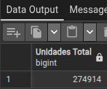
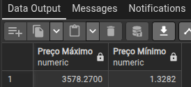
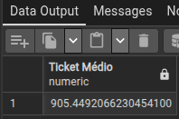
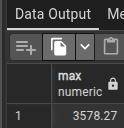

1 - Calcule quantas unidades foram vendidas no total.
         
    SELECT 
    SUM("OrderQty") AS "Unidades Total"
    FROM sales_salesorderdetail;

2 - Descubra o preço unitário mais caro e o mais barato do dataset.

    SELECT 
    MAX("UnitPrice") AS "Preço Máximo",
    MIN ("UnitPrice") AS "Preço Mínimo"
    FROM sales_salesorderdetail;

3 - Calcule o ticket médio por item vendido.

    SELECT 
    AVG("LineTotal") AS "Ticket Médio" 
    FROM sales_salesorderdetail;

4 - USANDO ROUND.

    SELECT 
    MAX(ROUND("UnitPrice", 2))
    FROM sales_salesorderdetail;

