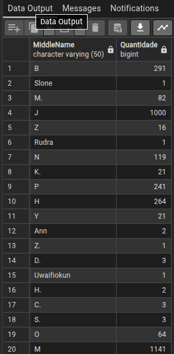
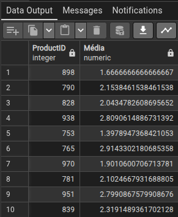
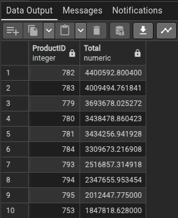
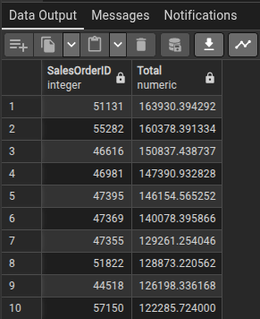
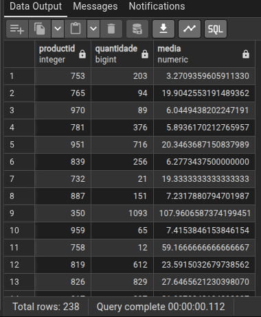

1 - QUANTAS PESSOAS TEM O MESMO NOME DO MEIO?

    SELECT "MiddleName", COUNT("MiddleName") AS "Quantidade"
    FROM person_person
    GROUP BY "MiddleName";

2 - QUAL É A QUANTIDADE MÉDIA DE CADA PRODUTO VENDIDO?

    SELECT "ProductID", AVG("OrderQty") AS "Média"
    FROM sales_salesorderdetail
    GROUP BY "ProductID";

3 - Quais são os 10 produtos com maior valor total de vendas? Do maior para o menor.

    SELECT 
      "ProductID", 
      SUM("LineTotal") AS "Total"
    FROM sales_salesorderdetail
    GROUP BY "ProductID"
    ORDER BY "Total" DESC
    LIMIT 10;

4 - Quais foram as 10 vendas com maior valor total? Do maior para o menor.

     SELECT 
      "SalesOrderID", 
      SUM("LineTotal") AS "Total"
    FROM sales_salesorderdetail
    GROUP BY "SalesOrderID"
    ORDER BY "Total" DESC
    LIMIT 10;

5 - QUANTOS PRODUTOS TEMOS CADASTRADO E A MÉDIA DOS MESMOS NAS ORDENS DE SERVIÇO?

    SELECT "productid", 
    COUNT("productid") AS "quantidade", 
    AVG("orderqty") AS "media"
    FROM production_workorder
    GROUP BY "productid";

