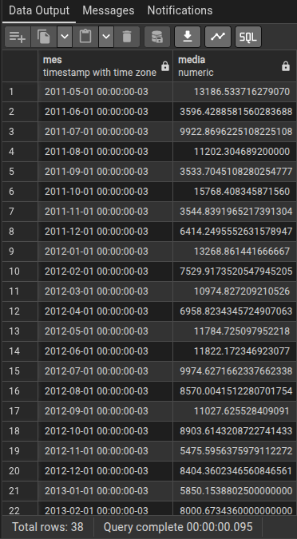
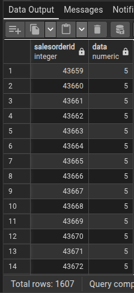

1 -  QUAL FOI A MÉDIA DO VALOR DEVIDO POR MÊS.
 
    SELECT 
        DATE_TRUNC('month', orderdate) AS mes,
     AVG(totaldue) AS media
    FROM sales_salesorderheader_clean
    GROUP BY mes
    ORDER BY mes;

2 - SELECIONAR TODAS A COMPRAS POR MÊS DE 2011.

    SELECT  salesorderid,
    EXTRACT(MONTH FROM orderdate) AS "data"
    FROM sales_salesorderheader_clean
    WHERE EXTRACT (YEAR FROM orderdate) = 2011;

    
