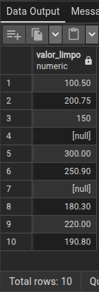
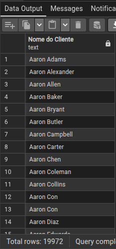
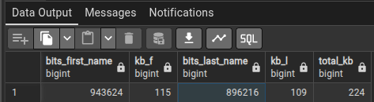

1 - LIMPEZA BÁSICA:
REMOVER ESPAÇOS EXTRA NOS NOMES
DEIXAR O EMAIL EM MINÚSCULO
PADRONIZAR CIDADE (PRIMEIRA LETRA MAIÚSCULA)

    SELECT TRIM(nome_cliente) AS cliente, 
           LOWER(TRIM(COALESCE(email, ''))) AS email,
 	       INITCAP(TRIM(cidade)) AS cidade
    FROM vendas_raw;

2 - TRATAMENTO DE VALOR:
VÍRGULA NO DECIMAL
VALORES VAZIOS 
VALORES INVÁLIDOS 
- TRANSFORMAR EM NUMERICO E INVÁIDOS PARA NULL

      WITH base AS (
      SELECT 
          REPLACE(TRIM(valor), ',', '.') AS valor_tratado
      FROM vendas_raw
      )
      SELECT 
         CASE 
           WHEN valor_tratado ~ '^-?[0-9]+(\.[0-9]+)?$' 
           THEN valor_tratado::NUMERIC 
           ELSE NULL 
         END AS valor_limpo
      FROM base;

3 - COLOCAR O NOMES E OS SOBRENOMES DOS CLIENTE SOMENTE EM UMA COLUNA.

     SELECT CONCAT("FirstName",' ', "LastName") AS "Nome do Cliente"
     FROM person_person
     ORDER BY "Nome do Cliente";

    

4 - ACHE A QUANTIDADE DE BITS E KB DAS COLUNAS FIRSTNAME E LASTNAME, E O TOTAL DE KB DAS DUAS.

    WITH base AS (
    SELECT 
        SUM(BIT_LENGTH("FirstName")) AS bits_first_name,
        SUM(BIT_LENGTH("LastName")) AS bits_last_name
    FROM person_person
    )
    SELECT
        bits_first_name,
        bits_first_name / 8 / 1024 AS kb_f,
        bits_last_name,
        bits_last_name / 8 / 1024 AS kb_l,
    (bits_first_name + bits_last_name) / 8 / 1024 AS total_kb
    FROM base;

