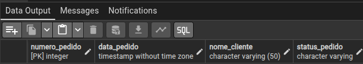
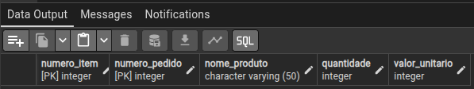

UMA EMPRESA VENDE PRODUTOS.
CADA PEDIDO PODE CONTER VÁRIOS ITENS.

TABELA 1: PEDIDOS

CRIE UMA TABELA QUE REPRESENTE UM PEDIDO COM:

IDENTIFICADOR DO PEDIDO

DATA DO PEDIDO

NOME DO CLIENTE

STATUS DO PEDIDO (EX: PENDENTE, PAGO, ENVIADO)

    CREATE TABLE pedidos(
    numero_pedido INT NOT NULL,
    data_pedido TIMESTAMP NOT NULL,
    nome_cliente VARCHAR(50),
    status_pedido VARCHAR NOT NULL,
    PRIMARY KEY (numero_pedido)
    );

TABELA 2: ITENS_PEDIDO

CRIE UMA TABELA QUE REPRESENTE OS ITENS DENTRO DO PEDIDO:

IDENTIFICADOR DO ITEM

IDENTIFICADOR DO PEDIDO (RELAÇÃO)

NOME DO PRODUTO

QUANTIDADE

VALOR UNITÁRIO

RELACIONAMENTO (O MAIS IMPORTANTE)

UM PEDIDO PODE TER VÁRIOS ITENS

UM ITEM PERTENCE A UM PEDIDO

    CREATE TABLE itens(
    numero_item INT NOT NULL,
    numero_pedido INT NOT NULL,
    nome_produto VARCHAR(50),
    quantidade INT NOT NULL,
    valor_unitario INT NOT NULL,
    FOREIGN KEY(numero_pedido) REFERENCES pedidos (numero_pedido),
    PRIMARY KEY(numero_pedido, numero_item)
    );

