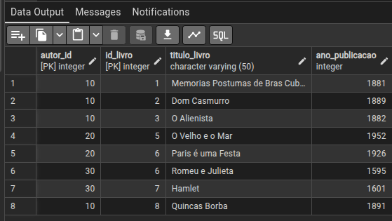
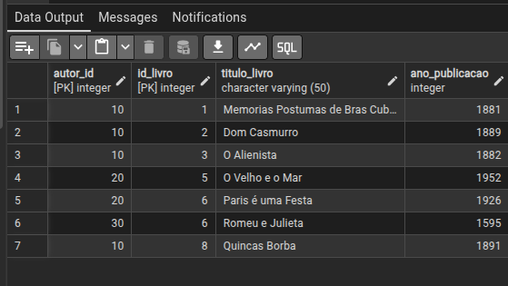
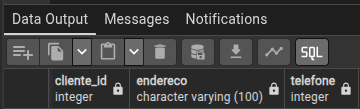
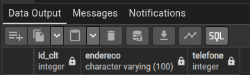

ALTERAR O id_livro '4', COM AS NOVAS INFORMAÇÕES DO id_livro 4.

    UPDATE livros
    SET id_livro = 4, titulo_livro = 'Quincas Borba', ano_publicacao = 1891
    WHERE id_livro = 8;

DELETAR HAMELET DA TABELA LIVROS.
   
    DELETE 
    FROM livros
    WHERE titulo_livro = 'Hamelt';

🔹ANTES 

🔹DEPOIS

CRIAR UMA NOVA TABELA COM 3 COLUNAS, DEPOIS:    

    CREATE TABLE pizzaria(
    cliente_id TEXT,
    endereco VARCHAR(30),
    telefone INT
    );

🔹ALTERAR O TIPO DA COLUNA   

    ALTER TABLE pizzaria
    ALTER COLUMN cliente_id TYPE INT
    USING cliente_id::INTEGER,
    ALTER COLUMN cliente_id SET NOT NULL,
    ALTER COLUMN endereco TYPE VARCHAR (100),
    ALTER COLUMN endereco SET NOT NULL;

    
🔹RENOMEAR UM NOME DE UMA COLUNA   

    ALTER TABLE pizzaria
    RENAME COLUMN cliente_id TO id_clt;

🔹RENOMEAR O NOME DA TABELA 

    ALTER TABLE pizzaria RENAME TO pizzalivery;

