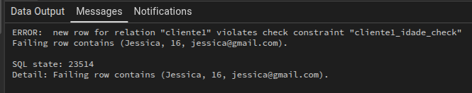
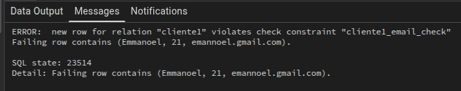
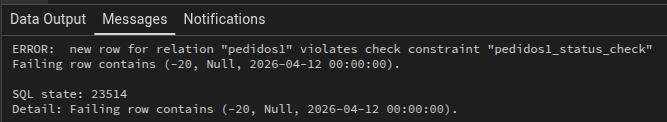
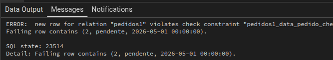

TABELA clientes  
🔹NOME - OBRIGATÓRIO   
🔹IDADE - DEVE SER MAIOR OU IGUAL A 18  
🔹EMAIL - DEVE CONTER '@"  

    CREATE TABLE cliente1(
    nome VARCHAR(50),
    idade INT CHECK (idade >= 18),
    email TEXT CHECK(email ~'@'));
--------------------------------------

    INSERT INTO cliente1(nome, idade, email)
    VALUES 
      ('Juliano', 31, 'juliano@gmail.com'),
	  ('Jessica', 16, 'jessica@gmail.com'),
	  ('Emmanoel', 21, 'emannoel.gmail.com')

TABELA pedidos  
🔹VALOR TOTAL - MAIOR QUE 0  
🔹STATUS - SOMENTE PENDENTE, PAGO E CANCELADO  
🔹DATA DO PEDIDO - NÃO PODE SER NO FUTURO  

    CREATE TABLE pedidos1(
    valor_total INT CHECK(valor_total > 0),
    status VARCHAR(20) CHECK(status IN('pendente', 'pago', 'cancelado')),
    data_pedido TIMESTAMP DEFAULT CURRENT_TIMESTAMP CHECK (data_pedido <= CURRENT_TIMESTAMP));
 ---------------------------------------------------------------------------------------------

    INSERT INTO pedidos1(valor_total, status, data_pedido)
    VALUES 
      (-20, 'Null', '2026-04-12'),
	  (50, 'pago', '2026-04-01'),
	  (1.800, 'pendente', '2026-05-01')

	
 

