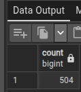

1 - QUANTOS PRODUTOS CADASTRADOS EXISTEM NA TABELA "PRODUCT"
   
    SELECT COUNT ("Name")

    FROM production_product

    WHERE "Name" <> '';
.

2 - QUANTOS TAMANHOS DIFERENTES DE PRODUTOS EU TENHO CADASTRADO NA TABELA "PRODUCT"

    SELECT COUNT ("Size")
    
    FROM production_product
    
    WHERE "Size" <> '';

