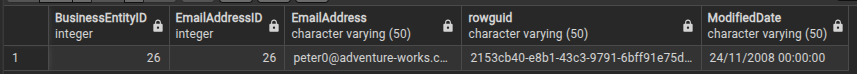
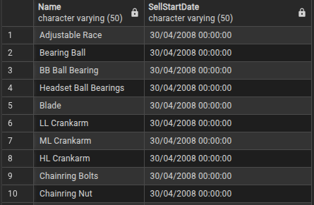
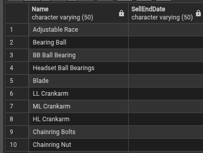

1 - A EQUIPE DE PRODUÇÃO PRECISA DO NOME DE TODAS AS PEÇAS QUE PESAM MAIS QUE 500KG, MAS NÃO MAIS QUE 700KG PARA INSPEÇÃO.

    SELECT "Weight"

    FROM production_product

    WHERE "Weight" > 500 AND "Weight" < 700;

2 - FOI PEDIDO PELO MARKETING UMA RELAÇÃO DE TODOS OS EMPREGADOS QUE SÃO CASADOS E ASSALARIADOS.

    SELECT *

    FROM humanresources_employee

    WHERE maritalstatus = 'M' and salariedflag = '1';

3 - UM USUÁRIO CHAMADO PETER KREBS ESTÁ DEVENDO UM PAGAMENTO, CONSIGA O EMAIL DELE PARA QUE POSSAMOS ENVIAR UMA COBRANÇA!

    SELECT *

    FROM person_person

    WHERE "FirstName" = 'Peter' and "LastName" = 'Krebs';

    SELECT * 

    FROM person_emailaddress

    WHERE "EmailAddressID" = 26;

    **POR MEIO DO VALOR DA COLUNA BusinessEntityID, OBTIVE O NÚMERO DE IDENTIFICAÇÃO PARA QUE EU USA-SE 
    COMO REFERẼNCIA NA TABELA person_emailaddress E LOCALIZA-SE O EMAIL.

4 - A) TRAGA PRODUTOS QUE COMEÇARAM A SER VENDIDOS ANTES DE 2010.
     
     SELECT "Name", "SellStartDate"
     
     FROM production_product
     
     WHERE EXTRACT(YEAR FROM TO_DATE("SellStartDate", 'DD/MM/YYYY')) < 2010;

    
    
4 - B) LISTE PRODUTOS QUE AINDA ESTÃO À VENDA.

    SELECT "Name", "SellEndDate"
  
    FROM production_product
  
    WHERE "SellEndDate" = '';

    
