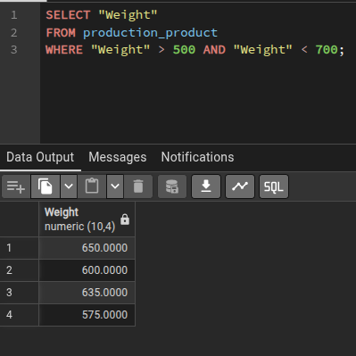
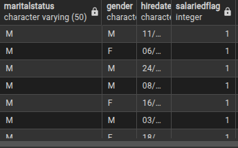

1 - A EQUIPE DE PRODUÇÃO PRECISA DO NOME DE TODAS AS PEÇAS QUE PESAM MAIS QUE 500KG, MAS NÃO MAIS QUE 700KG PARA INSPEÇÃO.

SELECT "Weight"

FROM production_product

WHERE "Weight" > 500 AND "Weight" < 700;

2 - FOI PEDIDO PELO MARKETING UMA RELAÇÃO DE TODOS OS EMPREGADOS QUE SÃO CASADOS E ASSALARIADOS.

SELECT *

FROM humanresources_employee

WHERE maritalstatus = 'M' and salariedflag = '1';

3 - UM USUÁRIO CHAMADO PETER KREBS ESTÁ DEVENDO UM PAGAMENTO, CONSIGA O EMAIL DELE PARA QUE POSSAMOS ENVIAR UMA COBRANÇA!

