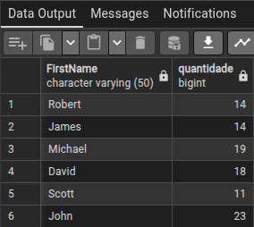
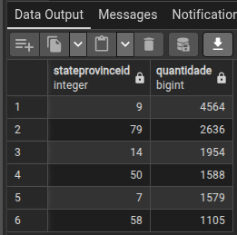

1 - QUAIS NOMES NO SISTEMA TEM UMA OCORRÊNCIA MAIOR QUE 10 VEZES, PORÉM SOMENTE ONDE O TÍTULO É 'Mr,'?

    SELECT "FirstName", COUNT("FirstName") AS "quantidade"
    FROM person_person
    WHERE "Title" = 'Mr.'
    GROUP BY "FirstName"
    HAVING COUNT("Title") >10
    ORDER BY "quantidade" DESC;

  

2 - Identificar as províncias (stateprovinceid) que aparecem mais de 1000 vezes.

    SELECT "stateprovinceid", COUNT("stateprovinceid") AS "quantidade"
    FROM person_address
    GROUP BY "stateprovinceid"
    HAVING COUNT ("stateprovinceid") >= 1000
    ORDER BY "quantidade" DESC;

