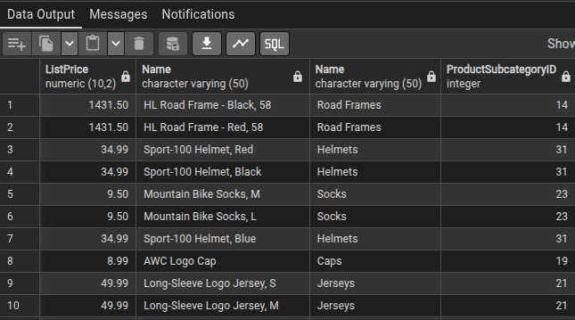
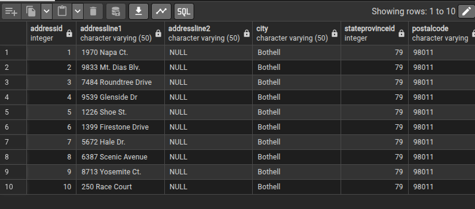
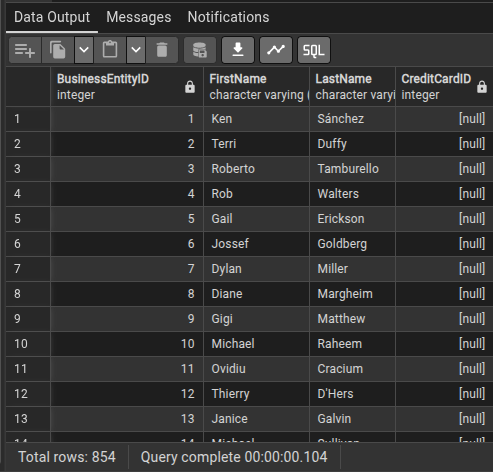

1 - BUSQUE O NOME DOS PRODUTOS E AS INFORMAÇÕES DAS SUBCATEGORIAS JUNTAMENTE COM OS PREÇOS. USAR AS TABELAS production_productsubcategory E production_product.

    SELECT 
    pp."ListPrice", 
    pp."Name", 
    ps. "Name",
    pp. "ProductSubcategoryID"
    FROM production_product pp
    INNER JOIN production_productsubcategory ps ON pp."ProductSubcategoryID" = ps."ProductSubcategoryID";

OBS: PODEMOS JUNTAR TODAS AS COLUNAS DAS TABELAS SEM DEFINIR COLUNAS ESPECÍFICAS.

    SELECT *
    FROM person_address pa
    INNER JOIN person_businessentityaddress pb ON pa.addressid = pb."AddressID"
    LIMIT 10;

2 - DESCOBRIR QUAIS PESSOAS NÃO POSSUEM UM CARTÃO DE CRÉDITO. 

    SELECT pp."BusinessEntityID", pp."FirstName", pp."LastName", sp."CreditCardID"
    FROM person_person pp
    LEFT JOIN sales_personcreditcard sp ON pp."BusinessEntityID" = sp."BusinessEntityID"
    WHERE sp."BusinessEntityID" IS NULL;

