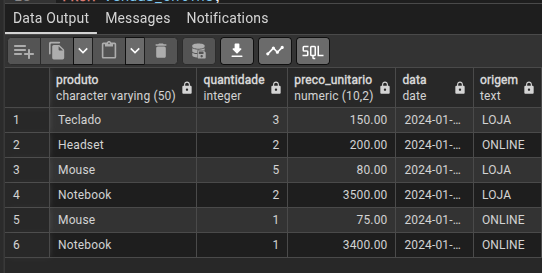

1 - CRIE UMA CONSULTA QUE UNA TODAS AS VENDAS (LOJA + ONLINE) COM AS SEGUINTES COLUNAS
produto
quantidade
preco_unitario
data
origem (LOJA ou ONLINE)

    SELECT 
       produto,
       quantidade,
       preco_unitario,
       data_venda AS data,
       'LOJA' AS origem
    FROM vendas_loja

    UNION 

    SELECT 
       produto,
       qtd AS quantidade,
       preco AS preco_unitario,
       data_pedido AS data,
      'ONLINE' AS origem
    FROM vendas_online;

  
