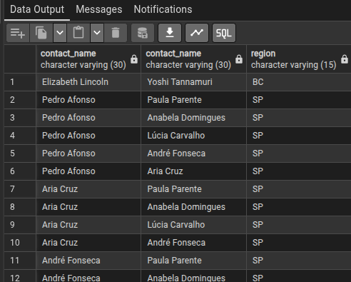
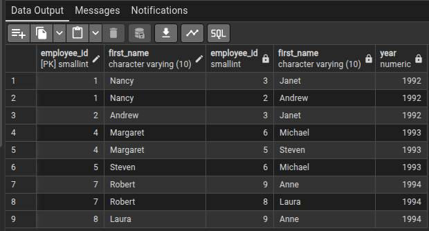

1 - LOCALIZAR TODOS OS CLIENTES QUE MORAM NA MESMA REGIÃO.

    SELECT a.contact_name, b.contact_name, a.region
    FROM customers a
    JOIN customers b 
      ON a.region = b.region
      AND a.customer_id < b.customer_id;

  
2 - TRAZER O NOME E A DATA DE TODOS FUNCIONÁRIOS QUE FORAM CONTRATADOS NO MESMO ANO.

    SELECT a.employee_id, a.first_name, b.employee_id, b.first_name,
    EXTRACT(YEAR FROM a.hire_date) AS year
    FROM employees a 
    INNER JOIN employees b 
      ON EXTRACT(YEAR FROM a.hire_date) = EXTRACT(YEAR FROM b.hire_date) 
    WHERE a.employee_id < b.employee_id;

3 - QUAIS OS PRODUTOS TEM O MESMO PERCENTUAL DE DESCONTO?

    SELECT 
       a.product_id,
       a.discount,
       b.product_id,
       b.discount
    FROM (
       SELECT DISTINCT product_id, discount
       FROM order_details
    ) a
    INNER JOIN (
       SELECT DISTINCT product_id, discount
       FROM order_details
    ) b
    ON a.discount = b.discount
    WHERE a.product_id < b.product_id;

