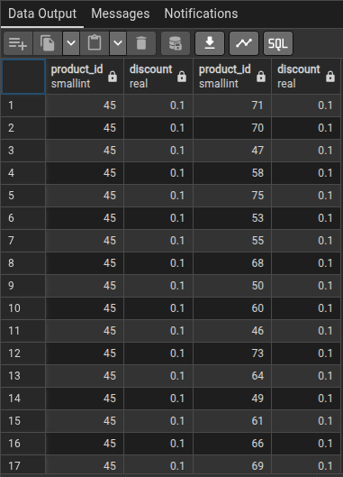
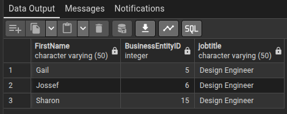

1 - QUAIS OS PRODUTOS TEM O MESMO PERCENTUAL DE DESCONTO?

    SELECT 
       a.product_id,
       a.discount,
       b.product_id,
       b.discount
    FROM (
       SELECT DISTINCT product_id, discount
       FROM order_details
       ) a
    INNER JOIN (
      SELECT DISTINCT product_id, discount
      FROM order_details
      ) b
    ON a.discount = b.discount
    WHERE a.product_id < b.product_id;

2 - RETORNAR OS NOMES DO FUNCIONÁRIOS QUE TEM O CARGO DE DESING ENGINEER.

    SELECT "FirstName"
    FROM person_person
    WHERE "BusinessEntityID" IN(SELECT businessentityid 
     FROM humanresources_employee 
	 WHERE jobtitle = 'Design Engineer');

