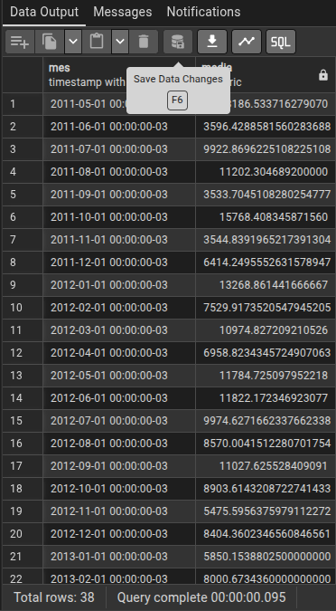

1 -  QUAL FOI A MÉDIA DO VALOR DEVIDO POR MÊS.
 
    SELECT 
        DATE_TRUNC('month', orderdate) AS mes,
     AVG(totaldue) AS media
    FROM sales_salesorderheader_clean
    GROUP BY mes
    ORDER BY mes;

