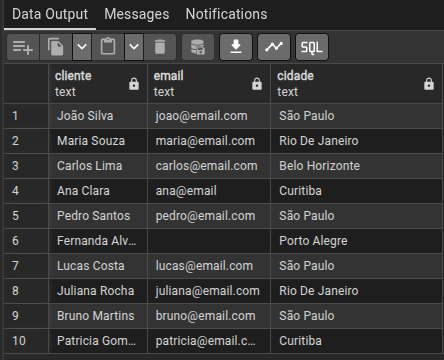

1 - LIMPEZA BÁSICA:
REMOVER ESPAÇOS EXTRA NOS NOMES
DEIXAR O EMAIL EM MINÚSCULO
PADRONIZAR CIDADE (PRIMEIRA LETRA MAIÚSCULA)

    SELECT TRIM(nome_cliente) AS cliente, 
           LOWER(TRIM(COALESCE(email, ''))) AS email,
 	       INITCAP(TRIM(cidade)) AS cidade
    FROM vendas_raw;

